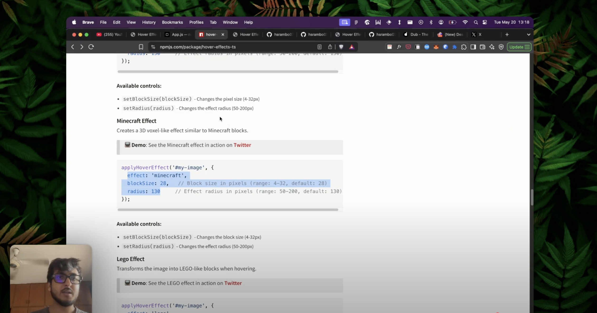
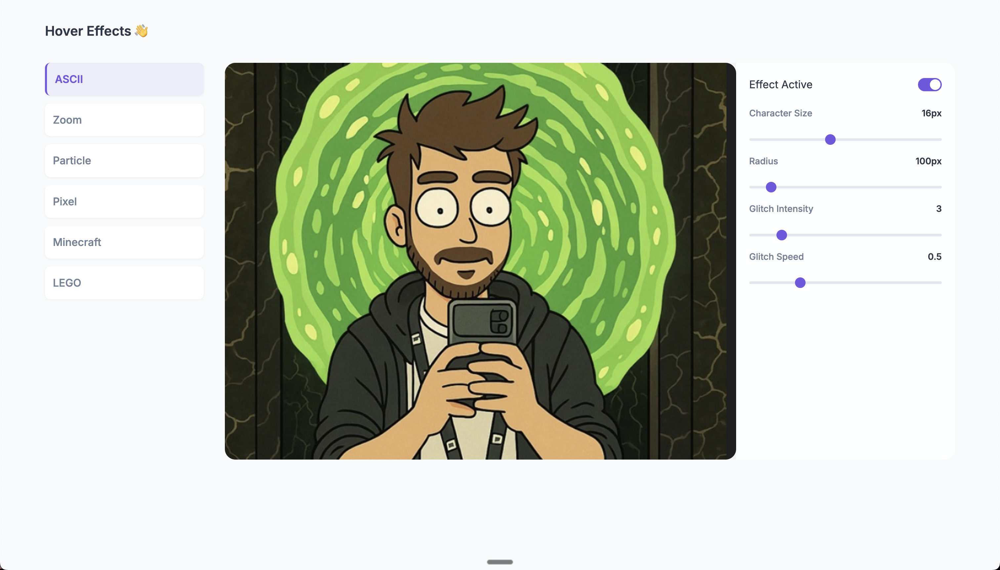

# Hover Effects TS

A collection of beautiful hover effects for images using canvas. Built with TypeScript and optimized for performance.

## 📺 Live Demos

### Video Demo
<div align="center">
  <a href="https://youtu.be/PjxFH-Q53zM" target="_blank">
    
  </a>
  <br/>
  <em>Click the image to view the demo video on YouTube</em>
</div>

### Interactive Playground

Check out our live demo to see all the effects in action:

[Vercel Demo](https://img-hover.vercel.app/)

<div align="center">
  
</div>

#### You can quickly figure out what values works best and directly plug those in your implementation :D.

<br>

## ✨ Features

- 🖼️ **Multiple Effects**: Choose from ASCII art, zoom, particle dust, pixel art, Minecraft-style, and Lego effects
- 🎨 **Canvas-based**: Smooth, performant animations using the Canvas API
- 📱 **Responsive**: Works with any image size
- 🎮 **Interactive**: Dynamic effects that respond to mouse movement
- 🔧 **Customizable**: Configure effect parameters in real-time
- 🚀 **Lightweight**: Minimal dependencies, focused on performance
- 📦 **Tree-shakable**: Only import the effects you need

## 📥 Installation

```bash
# Using npm
npm install hover-effects-ts

# Using yarn
yarn add hover-effects-ts

# Using pnpm
pnpm add hover-effects-ts
```

## 🚀 Quick Start Guide

### Basic Example

Add the effect to your image with just a few lines of code:

```html


<script type="module">
  import { applyHoverEffect } from 'hover-effects-ts';
  
  // Get your image element
  const image = document.getElementById('my-image');
  
  // Apply a cool ASCII effect
  applyHoverEffect(image, {
    effect: 'ascii',
    size: 16,
    radius: 100
  });
</script>
```

### Multiple Images

You can easily apply effects to multiple images at once:

```javascript
// Select all images with a specific class
const images = document.querySelectorAll('.hover-image');

// Apply the same effect to all of them
applyHoverEffect(images, {
  effect: 'zoom',
  scale: 1.2,
  radius: 100
});
```

### Using CSS Selector

You can also target elements using a CSS selector:

```javascript
// Apply effect to all images with a specific class
applyHoverEffect('.gallery-image', {
  effect: 'minecraft',
  blockSize: 8,
  radius: 130
});
```

## 📚 Example Usage Guide

For a comprehensive guide on using hover effects correctly, check out the `examples` directory, which includes:

1. **Interactive Usage Guide** - A complete example showing proper initialization and configuration:
   - `examples/usage-guide.html` - Interactive demo with UI controls
   - `examples/usage-guide.js` - Implementation with best practices

2. **Key Implementation Patterns**:
   - Waiting for images to load before applying effects
   - Using UI control values for initialization
   - Properly updating effects with setter methods
   - Debugging and troubleshooting techniques

Run the examples locally after installing:

```bash
# Clone the repository
git clone https://github.com/hsrambo07/hover-effects
cd hover-effects

# Install dependencies
npm install

# Build the library
npm run build

# Open the example in your browser
open examples/usage-guide.html
```

## 📦 Import Only What You Need

To reduce your bundle size, you can import only the specific effects you need:

```javascript
// Import only the effects you'll use
import { AsciiHover } from 'hover-effects-ts';

// Create the effect directly
const effect = new AsciiHover({ 
  size: 16,
  radius: 100
});

// Attach it to your image
effect.attach(document.querySelector('img'));

// Clean up when done
effect.destroy();
```

## 🎮 Interactive Controls

All effects support dynamic parameter updates:

```javascript
// Create an effect
const effect = applyHoverEffect('#my-image', {
  effect: 'ascii',
  size: 16,
  radius: 100
});

// Connect to UI sliders
document.getElementById('size-slider').addEventListener('input', (e) => {
  effect.setSize(parseInt(e.target.value));
});

document.getElementById('radius-slider').addEventListener('input', (e) => {
  effect.setRadius(parseInt(e.target.value));
});
```

## 🎨 Available Effects

### ASCII Art Effect

Transforms your image into dynamic ASCII characters when hovering.

> **📺 Demo**: See the ASCII effect in action on [YouTube](https://youtu.be/PjxFH-Q53zM)

```javascript
applyHoverEffect('#my-image', {
  effect: 'ascii',
  size: 16,              // Character size in pixels (range: 6-30, default: 16)
  radius: 100,           // Effect radius in pixels (range: 30-800, default: 100)
  glitchIntensity: 3,    // Intensity of the glitch effect (range: 0-20, default: 3)
  glitchSpeed: 0.5,      // Speed of the glitch effect (range: 0.1-20, default: 5)
  chars: ['█', '@', '%', '#', '*', '+', '=', '-', ':', '.', ' '] // Optional custom characters
});
```

**Available controls:**
- `setSize(size)` - Changes the character size (6-30px)
- `setRadius(radius)` - Changes the effect radius (30-800px)
- `setGlitchIntensity(intensity)` - Adjusts glitch intensity (0-20)
- `setGlitchSpeed(speed)` - Adjusts glitch animation speed (0.1-20)
- `setChars(chars)` - Sets custom character set

### Zoom Effect

Creates a magnifying glass effect when hovering.

> **📺 Demo**: See the zoom effect in action on [YouTube](https://youtu.be/PjxFH-Q53zM)

```javascript
applyHoverEffect('#my-image', {
  effect: 'zoom',
  scale: 1.2,    // Zoom scale (range: 1.1-2.0, default: 1.2)
  radius: 100    // Effect radius in pixels (range: 50-200, default: 100)
});
```

**Available controls:**
- `setScale(scale)` - Changes the zoom magnification level (1.1-2.0)
- `setRadius(radius)` - Changes the zoom lens radius (50-200px)

### Particle Dust Effect

Breaks the image into pixel particles that scatter when hovering.

> **📺 Demo**: See the particle effect in action on [YouTube](https://youtu.be/PjxFH-Q53zM)

```javascript
applyHoverEffect('#my-image', {
  effect: 'particle-dust',
  spacing: 4,     // Particle spacing in pixels (range: 2-10, default: 4)
  maxDrift: 28,   // Maximum particle drift distance (range: 10-50, default: 28)
  radius: 110     // Effect radius in pixels (range: 50-200, default: 110)
});
```

**Available controls:**
- `setSpacing(spacing)` - Changes particle density (2-10px)
- `setMaxDrift(maxDrift)` - Adjusts how far particles drift (10-50px)
- `setRadius(radius)` - Changes the effect radius (50-200px)

### Pixel Effect

Creates a pixelated effect when hovering.

> **📺 Demo**: See the pixel effect in action on [YouTube](https://youtu.be/PjxFH-Q53zM)

```javascript
applyHoverEffect('#my-image', {
  effect: 'pixel',
  blockSize: 16,   // Pixel size in pixels (range: 4-32, default: 16)
  radius: 130     // Effect radius in pixels (range: 50-200, default: 130)
});
```

**Available controls:**
- `setBlockSize(blockSize)` - Changes the pixel size (4-32px)
- `setRadius(radius)` - Changes the effect radius (50-200px)

### Minecraft Effect

Creates a 3D voxel-like effect similar to Minecraft blocks.

> **📺 Demo**: See the Minecraft effect in action on [YouTube](https://youtu.be/PjxFH-Q53zM)

```javascript
applyHoverEffect('#my-image', {
  effect: 'minecraft',
  blockSize: 28,   // Block size in pixels (range: 4-32, default: 28)
  radius: 130     // Effect radius in pixels (range: 50-200, default: 130)
});
```

**Available controls:**
- `setBlockSize(blockSize)` - Changes the block size (4-32px)
- `setRadius(radius)` - Changes the effect radius (50-200px)

### Lego Effect

Transforms the image into LEGO-like blocks when hovering.

> **📺 Demo**: See the LEGO effect in action on [YouTube](https://youtu.be/PjxFH-Q53zM)

```javascript
applyHoverEffect('#my-image', {
  effect: 'lego',
  blockSize: 16,   // Lego brick size in pixels (range: 8-40, default: 16)
  radius: 140,     // Effect radius in pixels (range: 80-200, default: 140)
  gap: 2,          // Gap between bricks (range: 1-5, default: 2)
  studScale: 0.33, // Scale of the studs on top of bricks (range: 0.2-0.7, default: 0.33)
  depth: 0.25,     // 3D effect depth (range: 0.1-0.4, default: 0.25)
  softEdge: 90,    // Softness of edge transition (range: 30-150, default: 90)
  fadeExp: 1.4     // Fade exponent for smooth transitions (range: 1.0-3.0, default: 1.4)
});
```

**Available controls:**
- `setBlockSize(blockSize)` - Changes the brick size (8-40px)
- `setRadius(radius)` - Changes the effect radius (80-200px)
- `setGap(gap)` - Adjusts spacing between bricks (1-5px)
- `setStudScale(scale)` - Changes the stud size on top of bricks (0.2-0.7)
- `setDepth(depth)` - Adjusts the 3D depth effect (0.1-0.4)
- `setSoftEdge(edge)` - Controls the edge softness (30-150px)
- `setFadeExp(exp)` - Adjusts the fade exponent for transitions (1.0-3.0)

## 🚀 Performance Tips

To keep your hover effects running smoothly:

1. **Image Size**: Use appropriately sized images. Very large images may impact performance.
2. **Effect Parameters**: 
   - For ASCII effect, larger character sizes improve performance
   - For Particle effect, larger spacing values reduce the number of particles
   - For Pixel/Minecraft effects, larger block sizes improve performance
3. **Radius**: Smaller effect radii generally perform better
4. **Clean Up**: Always call `destroy()` when removing effects to prevent memory leaks

## 🔧 Best Practices

### Initialization

For best results when initializing effects:

1. **Load Images First**: Ensure images are fully loaded before applying effects
   ```javascript
   const img = document.getElementById('my-image');
   img.onload = () => {
     const effect = applyHoverEffect(img, { effect: 'minecraft', blockSize: 28 });
   };
   ```

2. **Get UI Controls Values**: If using sliders or other UI controls, initialize with their actual values
   ```javascript
   const sizeSlider = document.getElementById('size-slider');
   const radiusSlider = document.getElementById('radius-slider');
   
   const effect = applyHoverEffect('#my-image', {
     effect: 'pixel',
     blockSize: parseInt(sizeSlider.value),
     radius: parseInt(radiusSlider.value)
   });
   ```

3. **Safely Update Effects**: Use setter methods for real-time updates without re-initialization
   ```javascript
   // Better than destroying and recreating the effect
   sizeSlider.addEventListener('input', (e) => {
     effect.setBlockSize(parseInt(e.target.value));
   });
   ```

### Debugging Tips

If you encounter issues with effects:

1. **Check Browser Console**: Enable console logging for detailed initialization info
2. **Monitor Effect State**: Create a debug button to log the internal state
   ```javascript
   const debugBtn = document.getElementById('debug-btn');
   debugBtn.addEventListener('click', () => {
     console.log('Effect state:', {
       blockSize: effect.getBlockSize?.() || 'N/A',
       radius: effect.getRadius?.() || 'N/A',
       samples: effect._getSamples?.()?.length || 'N/A'
     });
   });
   ```
3. **Canvas Inspection**: Use browser dev tools to examine the canvas element and its properties

## 🌐 Browser Support

The library is supported in all modern browsers:

- ✅ Chrome 60+
- ✅ Firefox 55+
- ✅ Safari 11+
- ✅ Edge 79+

## 🧪 Integration Examples

### Using with React

```jsx
import React, { useEffect, useRef } from 'react';
import { applyHoverEffect } from 'hover-effects-ts';

function HoverImage({ src, alt, effect }) {
  const imgRef = useRef(null);
  const effectRef = useRef(null);
  
  useEffect(() => {
    if (imgRef.current) {
      // Apply the effect
      effectRef.current = applyHoverEffect(imgRef.current, effect);
      
      // Clean up on unmount
      return () => {
        if (effectRef.current) {
          effectRef.current.destroy();
        }
      };
    }
  }, [effect]);
  
  return ;
}

// Usage
function App() {
  return (
    <HoverImage 
      src="/your-image.jpg" 
      alt="Interactive Image" 
      effect={{ 
        effect: 'ascii', 
        size: 16, 
        radius: 100 
      }} 
    />
  );
}
```

## 📄 License

MIT License - feel free to use this in your projects!

## 📝 Changelog

### Version 2.4.3
- Updated demo links to use YouTube instead of Twitter
- Added YouTube video thumbnail
- Improved documentation with consistent demo references
- Removed Twitter embed code

### Version 2.4.2
- Fixed ASCII effect radius parameter not working correctly
- Improved mouse position tracking and coordinate system handling
- Enhanced canvas positioning and scaling for consistent effect behavior
- Added debug information for troubleshooting

### Version 2.3.0
- Removed colored ASCII feature to improve performance
- Fixed TypeScript errors and improved type safety
- Added better null checks in particle dust effect

### Version 2.2.5
- Fixed Minecraft effect not respecting the provided blockSize parameter
- Fixed Pixel effect initialization with custom blockSize values
- Improved setBlockSize method implementation for both effects
- Added better error handling and safety checks for array bounds
- Enhanced debugging support to monitor effect states
- Ensured consistent behavior between Pixel and Minecraft effects

### Version 2.1.0
- Added real-time control ranges for all effects
- Improved performance with optimized rendering
- Fixed canvas scaling issues on high-DPI displays
- Added TypeScript strict mode support
- Improved error handling and type safety

### Version 2.0.0
- **BREAKING CHANGE**: Unified API for `applyHoverEffect`
- Added real-time parameter update support via setter methods
- Improved ASCII effect with better coloring and transparency
- Added LEGO effect with customizable studs and 3D appearance
- Fixed transparency issues in all effects
- Improved performance and rendering quality

### Version 1.2.0
- Added Particle Dust effect
- Fixed CORS issues with external images
- Improved error handling for different image types

### Version 1.1.0
- Added Minecraft and Pixel effects
- Fixed performance issues when using multiple effects
- Improved reusability with better cleanup methods

### Version 1.0.0
- Initial release with ASCII and Zoom effects
- Basic hover interaction support